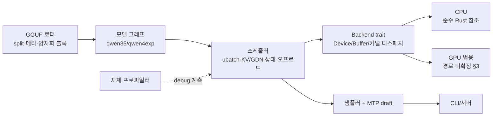

# 아키텍처

**순수 Rust** 원칙 하의 설계. 상태: 방침 확정 + GPU 커널 경로 1개 미확정(§백엔드).

## 데이터플로우

## 모드 체계

`universal` / `cmp-stock` / `cmp-unlocked` — [overview.md](overview.md) 표 참조.
- 모드 = 런타임 플래그 + **커널 변형 선택**(FMA 분해 half2 변형 vs 풀레이트 변형) + 메모리 예산 프로파일.
- 엔진 코어(로더·그래프·스케줄러·샘플러)는 모드 무관. 모드 의존 코드는 커널 선택과 메모리 플래너로 국한.

## 백엔드 전략 (순수 Rust 제약 하)

### 확정

1. **CPU 백엔드 (순수 Rust)** — 참조 구현이자 `universal` 기본. 모든 수치 golden 테스트의 기준. GPU 없이 전 로직 검증.
2. **Backend trait** — context/buffer 할당/복사/커널 디스패치/동기화. 백엔드별 크레이트, 런타임 선택(`--backend`), 빌드 feature 아님(단일 바이너리).
3. **프로파일러** — span/event 매크로, debug 수집·release zero-cost(feature로 on 가능). CUDA 측 CUPTI 연동 여지(cudarc 지원).

### 미확정 — 범용 GPU 커널 경로 (후보 분석)

| 후보 | 순수 Rust | 상태(2026-08) | 비고 |
|---|---|---|---|
| **wgpu + WGSL**(naga로 빌드타임 컴파일, 툴체인 전부 Rust) | 셰이더는 WGSL(Rust 아님, 외부 언어·컴파일러 없음) | 성숙 (wgpu 30.x) |coopmat이 실험적(8×8 f32) — fp16 고성능 GEMM 한계. 범용 노말 경로로는 최강 |
| **rust-gpu** (.rs 커널 → SPIR-V, Vulkan 실행) | 완전 | 재부팅 후 활발, early | 이상형이나 성숙도 리스크. 커널을 .rs로 쓰는 유일한 경로 |
| **ash(raw Vulkan)** + WGSL/GLSL 자산 | 부분 | 성숙 | llama.cpp 급 coopmat 경로는 GLSL(C계열) — 순수 Rust 정신과 충돌 |
| **cuda-oxide** (.rs → PTX) | 완전 | α (NVLabs, 활발) | CUDA 전용. CMP 도착 후 재평가 |
| **cudarc NVRTC + C 문자열 커널** | 커널만 C++ | 성숙 | ADR-0001 위반 — 폐기 |

- 결정 시점: **CPU 참조로 qwen35 전 경로 완성 후** 범용 GPU 백엔드 착수 시. 그때까지 wgpu(성숙도) vs rust-gpu(순수성) 트레이드오프를 실제 커널 1개(f32 matmul)로 프로토타이핑해 결정한다.
- CMP의 CUDA 네이티브 경로: 하드웨어 도착 후 (a) Vulkan 노출 확인 → 범용 경로 그대로 사용, (b) 미노출/성능 부족 → cuda-oxide 성숙도 재평가. 그 전까지 CUDA 전용 코드 작성 금지(작성해도 이 PC에서 검증 불가).

### FP 시맨틱스와 cmp-stock 규칙의 자연 성립

Rust는 기본 strict FP(암시 FMA contraction 없음). LLVM/spir-v 코드젠도 contract 플래그 없이는 mul+add를 융합하지 않음. 따라서:
- 핫패스에서 **`f32::mul_add` 호출 금지** (명시적 FMA = cmp-stock에서 32× 페널티).
- 컴파일러 플래그(fast-math 계열) 사용 금지.
- 이 규칙만으로 universal→cmp-stock 커널 공유 성립. `cmp-unlocked`은 언락 실측 후 풀레이트 변형(mul_add 허용)을 별도 추가.
- 검증 의무: 각 백엔드에서 생성 코드에 FMA 부재 확인(SASS/SPIR-V 덤프) — 프로파일러/CI 절차에 포함.

## 필수 커널 면 (두 모델 공통 기준)

`gated_delta_net`(fused AR + chunked), `ssm_conv`, `solve_tri`/`cumsum`/`tri`(chunked GDN), `l2_norm`, `top_k`(QSA·MoE), `argsort_top_k`(MoE 라우팅), `mul_mat_id`(전문가 GEMM), IMROPE(sections [11,11,10,0]), K-quant 디블록 GEMM(Q4_K/Q6_K/Q8_K), `get_rows`(PLE 20M-row 테이블, 오프로드). PLE 해시(호스트 u64)는 CPU Rust로 직이식.
나머지는 표준 원소연산(mul/silu/rms_norm/softmax/…). 상세: [source/research §3](../source/research/2026-08-30-qwen35-qwen4exp-arch.md).

## 메모리/스케줄러 설계 기능

- 하이브리드 캐시: 층별 KV(full-attn만) vs GDN R/S 상태 + 롤백 스냅샷 행.
- 오프로드 플래너: 텐서 단위 CPU/NVMe 배치(BAR1 64MiB, PCIe 0.85 GB/s 전제). PLE 패턴이 원형.
- MTP draft(27B) — qwen4exp는 GGUF에 MTP 없음.

## 단계별 계획 (초안)

1. **워크스페이스 스캐폴드** + GGUF 파서(메타/split/텐서 헤더) + gguf_dump 상등 검증.
2. **CPU 백엔드 + qwen35 추론 전 경로**(양자화 디블록 포함) — llama.cpp 출력과 토큰 정합.
3. **프로파일러** v1 — 2단계 계측으로 실전 검증.
4. **qwen4exp** (HC/QSA/PLE/MoE) CPU 경로.
5. **범용 GPU 백엔드** 결정·구현(§미확정 프로토타이핑) — 이 PC에서 8060S 타깃.
6. CMP 도착: 언락·스로틀 실측 → `cmp-unlocked` 커널 변형.
